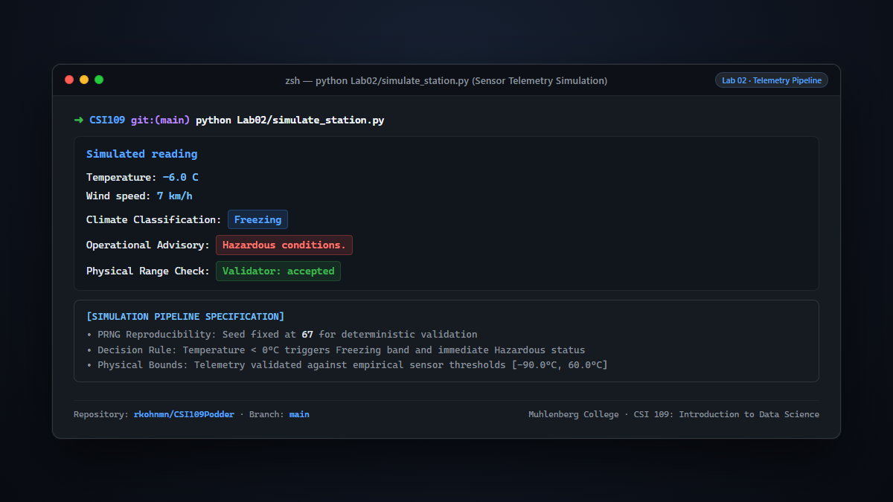
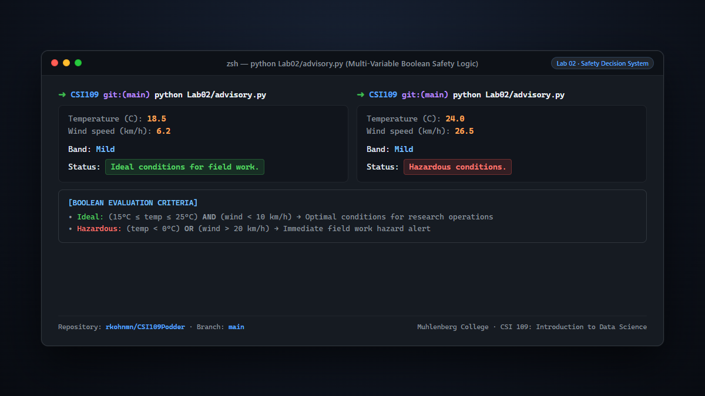
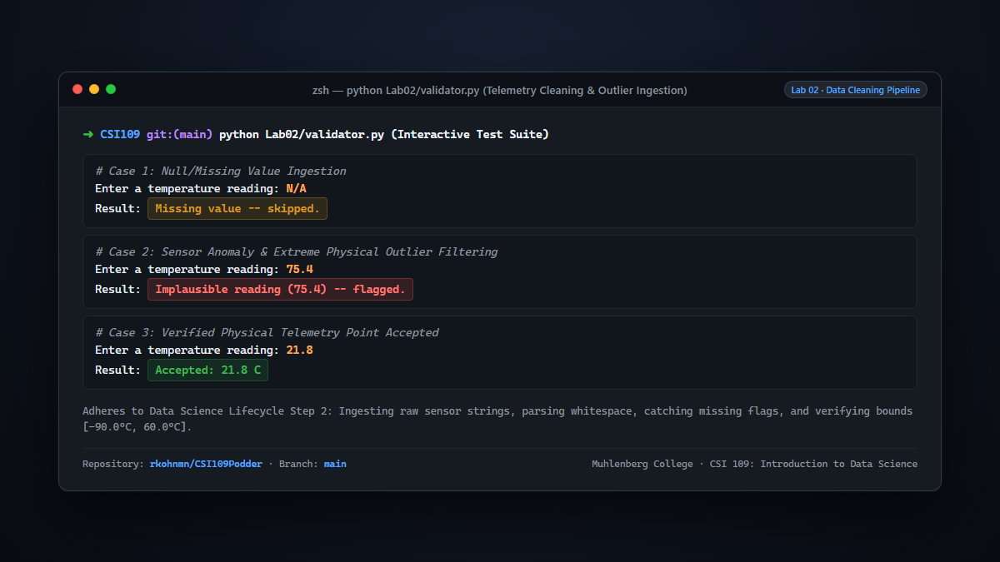
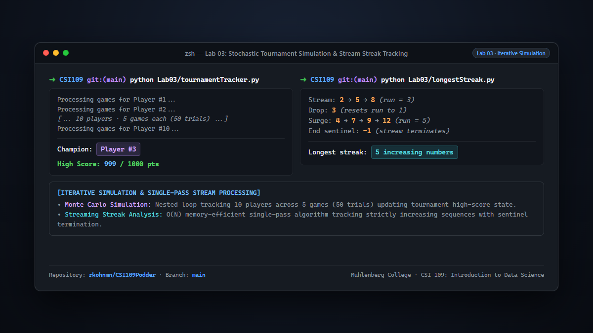
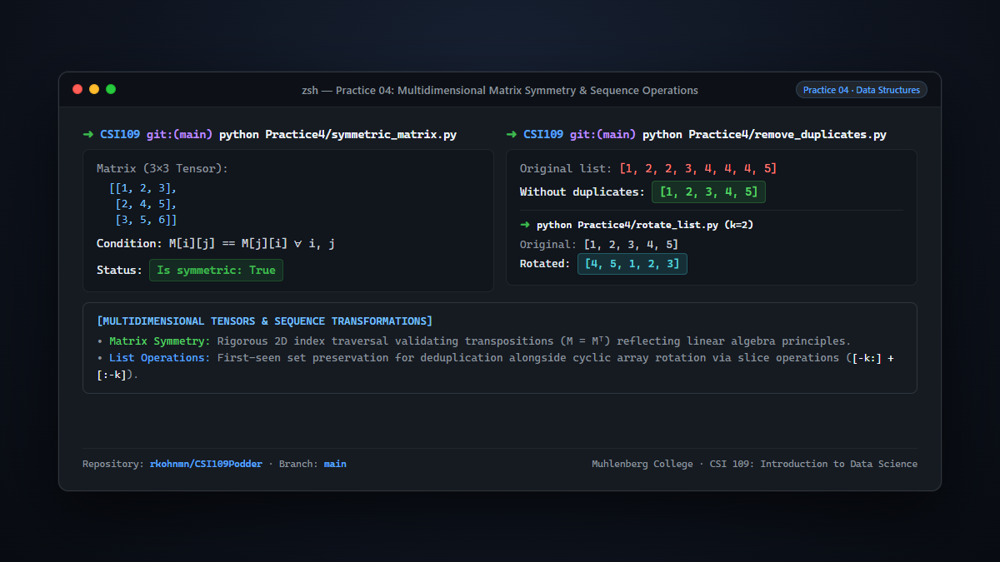
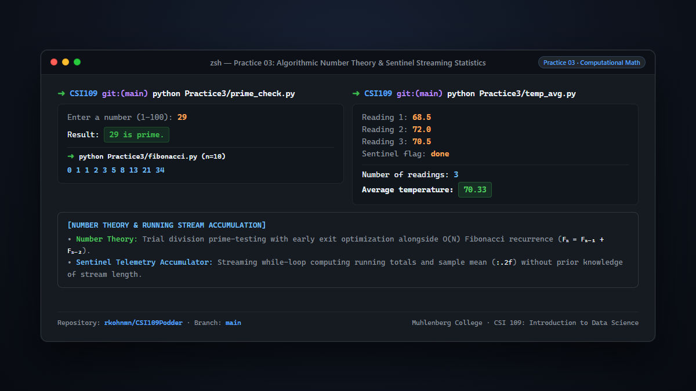

# CSI 109: Introduction to Data Science

[](https://www.python.org/)
[](https://www.muhlenberg.edu/)
[](https://www.muhlenberg.edu/)
[]()
[]()

Comprehensive coursework, laboratory assignments, computational practice problem sets, and data pipeline projects for **CSI 109: Introduction to Data Science** at **Muhlenberg College** (Fall 2026), instructed by **Dr. Proyash Podder**.

---

## About the Student

**Robert Kohn** (`rkohnmn`)  
*Student-Athlete & Triple Major — Muhlenberg College*

- **Majors**: Mathematics, Statistics, and Physics
- **Athletics**: Muhlenberg College Football; All Centennial Conference Honor Roll
- **Leadership & Campus Life**: President, Intramural Volleyball Club
- **Education Focus**: Valid background check and fingerprint clearance for Education concentration
- **Professional & Leadership Experience**:
  - Disney Leadership Training Program (Sophomore Year)
  - Head Chef, Weston Field Club (Summer 2026)

---

## Course Information

| Field | Detail |
| :--- | :--- |
| **Course** | CSI 109: Introduction to Data Science |
| **Institution** | Muhlenberg College |
| **Term** | Fall 2026 |
| **Instructor** | Dr. Proyash Podder (He/Him) |
| **Classroom** | Trumbower 048 |
| **Schedule** | Mon & Wed 11:00 AM – 12:15 PM; Fri 11:00 – 11:50 AM |
| **Office Hours** | Mon & Wed 9:00 – 9:30 AM & 12:15 – 1:15 PM (Trumbower 143) |

### Key Learning Outcomes

1. **Algorithmic Programming**: Build robust Python programs using variables, control flow, loops, collections, and modular functions.
2. **File & Data Wrangling**: Ingest, parse, and clean unstructured and structured data (CSV, raw text), handling real-world anomalies.
3. **Data Analysis (`pandas`)**: Filter, aggregate, join, and compute summary metrics to extract domain insights.
4. **Data Visualization (`matplotlib`)**: Design clear, truthful charts and plots communicating analytical findings.
5. **Data Acquisition**: Retrieve live data via RESTful web APIs and web scraping pipelines.
6. **Critical Data Ethics**: Assess algorithmic bias, privacy implications (re-identification risks), and ethical communication of results.

---

## Grading Scheme

| Component | Weight | Description |
| :--- | :---: | :--- |
| **Labs** | 25% | Hands-on programming and computational problem solving (10–12 labs) |
| **Exam I** | 20% | Midterm assessment covering core Python constructs |
| **Exam II** | 20% | Assessment covering data structures, files, and exception handling |
| **Projects** | 20% | 2 Mini Projects + 1 Capstone Final Project |
| **Quizzes** | 10% | Weekly Monday comprehension checks (10–12 quizzes) |
| **Participation** | 5% | Class engagement and active problem-solving |

---

## Course Roadmap

| Week | Date Range | Topic Focus | Status |
| :---: | :--- | :--- | :---: |
| **01** | 08/31 – 09/04 | Environment Setup, Course Overview, "What is Data Science?" | Completed |
| **02** | 09/07 – 09/11 | Python Syntax, Types, Operations & Expressions | Completed |
| **03** | 09/14 – 09/18 | Conditionals, Decision Trees & Control Flow | Completed |
| **04** | 09/21 – 09/25 | Loops & Iteration (`for`, `while`) | Completed |
| **05** | 09/28 – 10/02 | Sequence Types & Lists | Completed |
| **06** | 10/05 – 10/09 | Course Review & **Exam 1** | In Progress |
| **07** | 10/12 – 10/16 | Associative Data: Dictionaries, Tuples & Sets | Upcoming |
| **08** | 10/19 – 10/23 | Modular Programming: Functions & Modules | Upcoming |
| **09** | 10/26 – 10/30 | File I/O & Tabular Data (CSV Handling) | Upcoming |
| **10** | 11/02 – 11/06 | Error Handling & Exceptions (`try`/`except`) | Upcoming |
| **11** | 11/09 – 11/13 | Comprehensive Review & **Exam 2** | Upcoming |
| **12** | 11/16 – 11/20 | Tabular Data Analysis with `pandas` | Upcoming |
| **13** | 11/23 – 11/27 | Exploratory Visualization with `matplotlib` | Upcoming |
| **14** | 11/30 – 12/04 | External Data Gathering: Web APIs & Web Scraping | Upcoming |
| **15** | 12/07 – 12/11 | Natural Language & Text Analysis; Capstone Project Development | Upcoming |
| **16** | 12/14 – 12/18 | Capstone Final Project Presentations & Delivery | Upcoming |

---

## Repository Structure

```text
CSI109Podder/
├── .gitignore                      # Python build, cache, environment, and build ignore rules
├── README.md                       # Comprehensive course portfolio documentation
├── 9.14.26.py                      # In-class script: temperature thresholds and nested branches
├── 9.16.26.py                      # In-class script: decision structures and control logic
├── Lab01/                         # Lab 01: Python Fundamentals & Calculations
│   ├── art.py                     # ASCII art generation using multiline string formatting
│   ├── density.py                 # Mass, volume, and physical density calculations
│   ├── lineSlope.py               # Geometric coordinate calculations and line slope formula
│   └── survey.py                  # User input capture, formatted summary reporting
├── Lab02/                         # Lab 02: Validation, Logic & Simulations
│   ├── advisory.py                # Environmental/weather advisory decision logic
│   ├── simulate_station.py        # Sensor telemetry simulator and state machine
│   └── validator.py               # Data format and range input validation
├── Lab03/                         # Lab 03: Iteration, Simulation & Game Loops
│   ├── guessingGame.py            # Number guessing game with finite chance counter
│   ├── longestStreak.py           # Dynamic stream tracking for increasing numeric runs
│   └── tournamentTracker.py       # Monte Carlo tournament simulator tracking high scores
├── Practice1/                     # Practice Set 1: Basic Expressions & Conversions
│   ├── ASCII.py                   # Character output patterns
│   ├── celsius_to_farenheit.py    # Temperature unit conversion formula
│   ├── concatentation.py          # String manipulation and concatenation rules
│   ├── inputctf.py                # Interactive input parsing
│   ├── rectangle.py               # Geometric area and perimeter calculations
│   ├── rounding.py                # Floating point precision and rounding techniques
│   ├── Seconds.py                 # Time unit decomposition (seconds to h/m/s)
│   ├── semanticerror.py           # Debugging semantic logic errors
│   ├── swap.py                    # Variable swapping patterns
│   └── type_inspector.py          # Python type reflection and introspection
├── Practice2/                     # Practice Set 2: Branching & Conditional Logic
│   ├── discount_calc.py           # Tiered customer discount calculations
│   ├── even_odd.py                # Parity checking using modulo operations
│   ├── leap_calc.py               # Gregorian leap year algorithm
│   ├── leap_calc_better.py        # Optimized leap year evaluation
│   ├── lexicon_type.py            # Categorical string classification
│   ├── nested_mix_max.py          # Multi-variable minimum/maximum boundary checks
│   ├── quadrant.py                # 2D Cartesian plane coordinate quadrant resolver
│   ├── ticket_price.py            # Demographic age-based pricing logic
│   ├── time_diff.py               # Elapsed time difference calculation
│   └── triangle.py                # Triangle inequality theorem and classification
├── Practice3/                     # Practice Set 3: Loops, Iteration & Mathematical Series
│   ├── digit_sum.py               # Iterative modulo digit summation
│   ├── factorial.py               # Iterative factorial calculation
│   ├── fibonacci.py               # Fibonacci recurrence series generator
│   ├── number_triangle.py         # Nested loop numeric patterns
│   ├── prime_check.py             # Trial-division primality check with early exit
│   ├── prime_list.py              # Range prime filtering via nested loops
│   ├── reverse_int.py             # Arithmetic integer reversal
│   ├── temp_avg.py                # Sentinel-driven streaming temperature accumulation
│   ├── triangle_pattern.py        # Nested loop ASCII geometric patterns
│   └── vowel_count.py             # String character iteration and classification
├── Practice4/                     # Practice Set 4: Sequence Types & List Algorithms
│   ├── access_update_list.py      # List indexing, boundary access, and in-place mutation
│   ├── append_to_list.py          # Dynamic list growth and collection population
│   ├── check_sorted.py            # Monotonic ascending sequence verification
│   ├── count_evens.py             # Parity filter and frequency accumulation
│   ├── count_occurrences.py       # Linear occurrence scanning
│   ├── element_existence.py       # Membership testing and linear search
│   ├── filter_odds.py             # Conditional sequence filtering
│   ├── multiply_elements.py       # Scalar element-wise transformation
│   ├── nested_list_sum.py         # Multidimensional nested list reduction
│   ├── remove_duplicates.py       # Stable first-seen sequence deduplication
│   ├── reverse_list.py            # List sequence reversal
│   ├── rotate_list.py             # Cyclic array rotation via slice operations
│   ├── sum_max_min.py             # Descriptive aggregate metrics (sum, min, max)
│   └── symmetric_matrix.py        # 2D matrix tensor symmetry verification (M = Mᵀ)
├── docs/screenshots/              # High-resolution portfolio showcase assets (1200x675 PNG)
│   └── README.md                  # Screenshot catalog and technical specifications
└── scripts/                       # Developer automation utilities
    └── generate_screenshots.py    # Automated headless browser screenshot renderer
```

---

## Showcase & Execution Previews

The following previews demonstrate verified program executions highlighting core data science competencies, algorithm design, and data structures.

### 1. Automated Weather Telemetry Simulation Pipeline
Deterministic PRNG sensor simulation with automated temperature band classification, hazardous condition detection, and hardware sensor range validation (`[-90.0°C, 60.0°C]`).



### 2. Multi-Variable Fieldwork Safety Decision System
Evaluation of compound Boolean logic assessing ambient conditions and field crew safety status:  
`((15°C ≤ temp ≤ 25°C) AND (wind < 10 km/h)) → Ideal` vs `((temp < 0°C) OR (wind > 20 km/h)) → Hazardous`.



### 3. Telemetry Ingestion & Sensor Outlier Validation
Adheres to Step 2 of the Data Science Lifecycle: catching missing flags (`N/A`), filtering extreme physical anomalies (`75.4°C`), and accepting verified telemetry points (`21.8°C`).



### 4. Stochastic Tournament Simulation & Stream Streak Analysis
50-match Monte Carlo tournament simulation tracking high scores across 10 competitors, paired with an $O(N)$ single-pass stream processing algorithm detecting maximum strictly increasing sequences with sentinel termination (`-1`).



### 5. Multidimensional Matrix Symmetry & Sequence Operations
Linear algebra 2D matrix tensor symmetry verification ($M_{i,j} == M_{j,i}$), stable first-seen list deduplication, and slice-based cyclic array rotation (`[-k:] + [:-k]`).



### 6. Computational Number Theory & Streaming Sensor Statistics
Trial division primality testing with early exit optimization, iterative Fibonacci series generation ($F_n = F_{n-1} + F_{n-2}$), and sentinel-terminated streaming temperature aggregation (`:.2f`).



---

## Technical Environment

- **Language**: Python 3.10+
- **Editor**: Visual Studio Code
- **Automation**: Headless Chromium screenshot pipeline (`scripts/generate_screenshots.py`)
- **Key Libraries** *(second half of semester)*:
  - `pandas` for dataset manipulation, wrangling, and aggregation
  - `matplotlib` for charts, histograms, and statistical graphics
  - `requests` for web APIs and automated data scraping

---

## Academic Integrity

All code in this repository is developed by **Robert Kohn** (`rkohnmn`) in accordance with the Muhlenberg College Academic Integrity Code and the CSI 109 Collaboration Policy.
